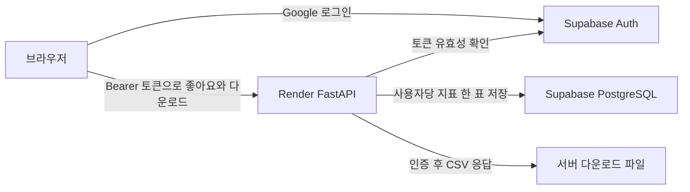

# Google 로그인과 지표 좋아요 연결 가이드

브랜치 `feat/google-members-likes`는 Google 로그인, 로그인 후 CSV 다운로드, 지표별 좋아요와 인기 순위를 추가합니다. 게시판은 포함하지 않습니다. 기존 지표 화면은 로그인 없이 볼 수 있습니다. Google과 Supabase의 계정 설정을 마치면 같은 코드로 실제 서비스를 연결할 수 있습니다.

## 사용자가 이용하는 흐름

1. 로그인 없이 Overview와 6개 동인의 모든 지표·차트·필터, 부동산 기초·정책 자료, 인기 순위를 봅니다. 로그인 설정이 없거나 인증 서버에 문제가 있어도 지표 열람은 계속할 수 있습니다.
2. 자료 다운로드나 좋아요 기능이 필요할 때 **Google 로그인**으로 계정을 연결합니다. 별도 비밀번호는 만들지 않습니다.
3. 대시보드 지표에서 좋아요를 누르거나 취소합니다. 같은 사람이 같은 지표를 여러 번 눌러도 한 표이며, 자신의 선택은 채워진 하트로 표시됩니다.
4. **인기 지표**에서 자신이 좋아요한 지표를 모아 봅니다. 다른 회원의 이름이나 이메일, 좋아요 목록은 공개하지 않습니다.
5. **자료실**에서 시계열 샘플과 변수 사전을 CSV로 내려받습니다. 다운로드 API도 로그인 여부를 검사합니다.

시계열 CSV는 현재 공개 대시보드에 쓰는 샘플을 정리한 자료입니다. 공개 JSON 자체를 비공개로 전환한 기능은 아닙니다. 서울·경기·부산과 강남·마포·노원 등의 샘플을 담고 있으며 전체 원자료가 아닙니다. 값이 없는 셀은 빈칸으로, 원본에 잠정 표시가 있는 관측치는 `잠정여부` 열에 표시합니다. 파일은 Excel에서 한글을 읽을 수 있도록 UTF-8 BOM으로 저장합니다.

## 먼저 로컬 화면 보기

저장소 루트 `realestate`에서 PowerShell로 실행합니다. Python 3.11 이상이 필요합니다.

```powershell
powershell -ExecutionPolicy Bypass -File scripts/start_members_preview.ps1 -InstallDependencies
```

첫 실행은 `.venv`를 만들고 필요한 Python 패키지를 설치한 후 두 서버를 백그라운드에서 실행합니다. 화면은 아래 주소에서 엽니다.

- 대시보드: http://127.0.0.1:5500/
- 인기 지표: http://127.0.0.1:5500/popular.html
- 자료실: http://127.0.0.1:5500/downloads.html
- API 문서: http://127.0.0.1:8000/docs

로그는 `tmp/members-preview/`에 저장됩니다. 종료 명령은 시작 스크립트가 출력하는 `Stop-Process -Id ...`를 사용합니다. 이미 8000 또는 5500 포트를 쓰는 서버가 있으면 먼저 그 서버를 종료합니다.

설정이 없으면 화면에 로그인 준비 상태가 표시됩니다. 로그인 없이 실제 계정처럼 쓰는 시험 모드는 제공하지 않습니다. 좋아요 저장은 `DATABASE_URL`이 비어 있으면 로컬 SQLite를 사용하고, 실제 운영은 아래 Supabase PostgreSQL로 연결합니다.

## 직접 설정할 항목

### 1 Supabase 프로젝트 확인

DB 연결 담당 팀원에게 같은 Supabase 프로젝트를 쓰는지 확인하고 다음 값을 받습니다.

| 값 | 찾는 곳과 용도 | 입력할 곳 |
|---|---|---|
| Project URL | Supabase 프로젝트 API URL, `https://프로젝트ID.supabase.co` | `SUPABASE_URL` |
| Publishable key | 프로젝트의 공개 API 키, `sb_publishable_...` | `SUPABASE_PUBLISHABLE_KEY` |
| Session pooler 연결 문자열 | Connect에서 복사하는 PostgreSQL 연결 문자열, 보통 5432 포트 | `DATABASE_URL` |

오래된 프로젝트의 `anon` 키도 지원합니다. `secret` 또는 `service_role` 키는 이 기능에 사용하지 않습니다. DB 비밀번호가 들어간 연결 문자열은 `backend/.env`나 Render 환경변수에만 보관합니다. Google 로그인 설정과 DB 연결 설정은 별도이며 둘 다 필요합니다.

### 2 Google 로그인 만들기

1. [Google Cloud Console](https://console.cloud.google.com/)에서 프로젝트를 선택합니다.
2. Google Auth Platform에서 앱 이름과 사용자 대상(Audience)을 설정합니다. 팀 테스트 중에는 Testing 상태의 테스트 사용자에 팀원 Google 계정을 추가합니다.
3. OAuth Client를 **웹 애플리케이션**으로 만듭니다.
4. Authorized JavaScript origins에 사용할 화면의 origin을 추가합니다. 로컬 예시는 `http://127.0.0.1:5500`이고, 배포 후에는 Vercel 주소도 추가합니다.
5. Authorized redirect URIs에는 **Supabase 관리 화면의 Google provider가 알려주는 callback 주소**를 입력합니다. 일반적인 형식은 `https://프로젝트ID.supabase.co/auth/v1/callback`입니다.
6. 발급된 Client ID와 Client Secret을 Supabase → Authentication → Sign In / Providers → Google에 넣고 Google provider를 활성화합니다. 이 값은 프론트엔드 파일에 넣지 않습니다.

로그인에는 기본 프로필과 이메일만 사용하며 Gmail 메일함 접근 권한은 요청하지 않습니다. Gmail 계정을 포함한 Google 계정으로 로그인할 수 있습니다. [Supabase Google 로그인 공식 안내](https://supabase.com/docs/guides/auth/social-login/auth-google)

### 3 Supabase 로그인 복귀 주소 등록

Supabase → Authentication → URL Configuration에서 Site URL을 실제 프론트엔드 주소로 설정하고 Redirect URLs에 아래 주소를 추가합니다.

```text
http://127.0.0.1:5500/auth-callback.html
http://localhost:5500/auth-callback.html
https://실제-프리뷰-주소.vercel.app/auth-callback.html
https://실제-운영-주소.vercel.app/auth-callback.html
```

실제로 사용할 주소만 등록하고 예시의 한글 부분은 교체합니다. Google의 callback은 **Supabase 주소**, Supabase의 redirect는 **우리 웹사이트 주소**입니다. 로그인 시작부터 복귀까지 같은 브라우저와 같은 origin을 사용해야 합니다. `localhost`와 `127.0.0.1`은 서로 다릅니다.

### 4 로컬 설정 넣기

기존 `backend/.env`가 있으면 덮어쓰지 말고 아래 항목을 추가하거나 수정합니다. 새 파일은 `backend/.env.example`을 복사해 만듭니다.

```dotenv
SUPABASE_URL=https://프로젝트ID.supabase.co
SUPABASE_PUBLISHABLE_KEY=sb_publishable_공개키
DATABASE_URL=postgresql+psycopg://postgres.프로젝트ID:DB비밀번호@풀러호스트:5432/postgres
ALLOWED_ORIGINS=http://127.0.0.1:5500,http://localhost:5500
```

연결 문자열은 Supabase에서 복사하고 비밀번호 부분을 채웁니다. 비밀번호에 `@`, `#`, `/` 등 URL 특수문자가 있으면 해당 부분을 URL 인코딩해야 합니다. 환경변수를 바꾼 뒤 API 서버를 재시작합니다.

서버는 시작할 때 `member_space.indicator_likes` 테이블을 자동 생성합니다. 초기 연결 계정에는 스키마와 테이블을 만들 권한이 필요합니다. Supabase Table Editor에서 기본 `public` 대신 `member_space` 스키마를 선택하면 확인할 수 있습니다. 이 스키마를 Data API의 Exposed schemas에 추가하지 않습니다.

### 5 팀 공유용 프리뷰 연결

현재 브랜치에 구현을 저장한 뒤, 팀에 공유할 시점에 실행합니다.

```powershell
git push -u origin feat/google-members-likes
```

Render에는 이 브랜치를 대상으로 별도 Web Service를 만들면 운영 서버와 구분해서 검토할 수 있습니다.

| Render 설정 | 값 |
|---|---|
| Branch | `feat/google-members-likes` |
| Root Directory | `backend` |
| Build Command | `pip install -r requirements.txt` |
| Start Command | `uvicorn app.main:app --host 0.0.0.0 --port $PORT` |
| Environment | `DATABASE_URL`, `SUPABASE_URL`, `SUPABASE_PUBLISHABLE_KEY`, `ALLOWED_ORIGINS` |

프리뷰의 데이터도 분리하려면 별도 Supabase 프로젝트를 사용합니다. 같은 `DATABASE_URL`을 쓰면 같은 좋아요가 집계됩니다.

Vercel 프로젝트의 Root Directory는 기존처럼 `frontend`입니다. 이 브랜치의 `vercel.json`은 `node build-config.mjs`를 실행합니다. Vercel **Preview 환경**의 `API_BASE_URL`에 새 Render 프리뷰 주소를 넣고 다시 배포합니다. 예: `https://realestate-members-preview.onrender.com`. 실제로 만든 서비스 주소를 사용하고 끝에 경로나 쿼리를 붙이지 않습니다. 이 값에는 공개 API 주소만 들어갑니다.

Vercel 프리뷰 주소가 정해지면 Render의 `ALLOWED_ORIGINS`에 그 origin을 추가하고, Google JavaScript origins와 Supabase Redirect URLs에도 위 절차대로 추가합니다. Render 환경변수에는 Vercel 화면 주소, Vercel 환경변수에는 Render API 주소를 넣는 점을 구분합니다.

팀 확인 후 `main`에 병합할 때는 운영 Render에도 회원용 환경변수를 설정하고, Vercel Production의 `API_BASE_URL`을 운영 API 주소로 맞춥니다. 다른 팀원의 정량 지표 브랜치와 함께 병합하면 `frontend/js/factors.js` 및 메뉴 변경 부분을 확인합니다.

### 6 연결 완료 확인

로컬 점검:

```powershell
python scripts/check_members.py
```

배포 점검:

```powershell
python scripts/check_members.py --api https://실제-API-주소.onrender.com
```

Google 로그인 설정값, 좋아요 DB 조회, 영구 PostgreSQL 저장소, 다운로드 파일 준비가 각각 표시됩니다. 전부 OK여도 실제 OAuth 로그인까지 검증한 결과는 아니므로 아래를 두 계정으로 확인합니다.

- 계정 A로 로그인 → 지표 하나에 좋아요 → 수가 1 증가하고 새로고침해도 유지.
- 같은 계정으로 다시 접속 → 이미 좋아요 상태. 취소하면 수가 1 감소.
- 계정 B로 로그인 → A의 좋아요 수는 보이지만 B의 버튼은 좋아요하지 않은 상태.
- 계정 B도 같은 지표에 좋아요 → 총 2표, 인기 순위에 반영.
- 로그아웃 → 내 좋아요 표시 제거, CSV 다운로드는 로그인 요구.
- 로그인 후 CSV 다운로드 → 한글, 숫자, 잠정 표시 확인.
- Render 재시작 후에도 좋아요 수 유지.

## 구현 구조와 유지보수



토큰은 Supabase Auth에 확인하고, 사용자 ID는 확인된 응답에서만 얻습니다. 좋아요 테이블은 사용자와 지표의 조합을 기본키로 사용합니다. Supabase의 브라우저용 역할은 이 테이블에 직접 접근할 수 없고, API는 집계 수와 현재 사용자의 선택만 반환합니다. 서버와 DB 관리자는 저장된 사용자 ID를 볼 수 있습니다.

| API | 용도 |
|---|---|
| `GET /members/config` | 공개 로그인 설정 |
| `GET /members/status` | 설정 및 DB 조회 상태 |
| `GET /members/me` | 현재 로그인 사용자 확인 |
| `GET /members/downloads` | 자료 목록 |
| `GET /members/downloads/{id}` | 로그인 후 파일 다운로드 |
| `GET /engagement/indicators` | 지표별 좋아요 집계와 나의 선택 |
| `GET /engagement/popular?limit=5` | 좋아요가 있는 인기 지표 |
| `PUT /engagement/indicators/{id}/like` | 좋아요, 반복 호출해도 한 표 |
| `DELETE /engagement/indicators/{id}/like` | 좋아요 취소 |

샘플과 변수 사전 변경 후 서버용 CSV와 지표 목록을 함께 갱신합니다.

```powershell
python scripts/build_member_downloads.py
python scripts/build_member_downloads.py --check
python -m pytest tests/backend -q
python tests/ui_members.py
```

브라우저 자동 테스트에는 별도로 `python -m pip install playwright`와 로컬 Microsoft Edge가 필요합니다. 테스트의 로그인 응답은 격리된 모의 응답이며 실제 Google/Supabase 계정 설정을 대신하지 않습니다.

이 브랜치에서 백엔드 테스트 54개, 회원 기능 브라우저 테스트, 기존 기초 자료·정책 화면 및 정책 히스토리 브라우저 테스트를 통과했습니다. 실제 로컬 API와 화면에서도 로그인 미설정 상태, 자료 목록, 빈 인기 순위, 모바일 배치를 확인했습니다. Google 실계정 OAuth와 Supabase PostgreSQL 연결은 위 설정을 마친 뒤 확인할 항목입니다.

교재의 3계층 웹 CRUD와 심화 과제인 Supabase Auth 사용자 구분을 참고했습니다. 이번 범위에서는 텍스트 게시물을 만들지 않고 로그인 사용자의 좋아요만 DB에 저장합니다. 공식 참고: [Google 로그인](https://supabase.com/docs/guides/auth/social-login/auth-google), [사용자 토큰 확인](https://supabase.com/docs/reference/javascript/auth-getuser), [Supabase API 접근 제어](https://supabase.com/docs/guides/api/securing-your-api).
