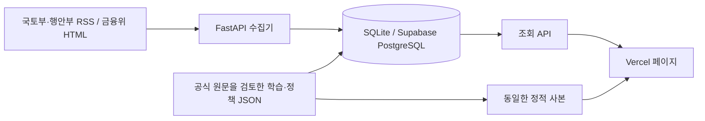

# 정성 자료 기능 · 팀 인수인계

현재 코드의 정성 자료 기능은 `learn.html`과 `policies.html`입니다. 기존 지표 대시보드의 색상, 헤더, 다크모드와 정적 HTML/CSS/JS 방식을 따릅니다. 구현 코드를 GitHub에 반영하면 기존 Vercel/Render 배포 설정을 그대로 사용할 수 있습니다. Supabase 실제 연결과 배포 검증은 팀에서 연결 정보를 설정한 뒤 진행합니다.

## 과제 조건과 구현

수업 안내 PDF 5~9쪽과 풀스택 교재 0~6장의 구성에 맞췄습니다.

| 과제 요구 | 이번 구현 |
|---|---|
| Vercel 프론트엔드 | 기존 HTML/CSS/JS에 부동산 기초·정책 모니터 페이지 추가 |
| Render FastAPI | 기초자료 조회, 정책요약 조회, 수집결과 조회, 관리자 수집 API |
| Supabase PostgreSQL | SQLAlchemy 모델·SQL 스키마·환경변수 전환 준비; 현재 로컬 SQLite 동작 |
| 외부 API·오픈데이터 또는 크롤링 | 국토부·행안부 공개 RSS와 금융위 공개 보도자료 HTML 수집 |
| 데이터 설명·기초 분석 페이지 | 출처, 수집방법, 검색·주제분류, 정책 핵심·적용조건·영향 경로·점검 항목 |
| API·DB 문서 | 이 문서, FastAPI `/docs`, `database/README.md`, `database/schema.sql` |

## 사용자와 활용 시나리오

주택시장을 공부하는 학생과 부동산 지표 이용자가 대상입니다. 지표의 변화가 이해되지 않을 때 기초 용어를 찾고, 정책 발표의 대상·조건·일정을 함께 확인합니다. 정책 영향 경로와 점검 항목은 교육용 해설이며 가격 예측·투자 추천이나 법률 판단을 대신하지 않습니다.

팀 발표에서는 `지표 확인 → 관련 용어 검색 → 정책 상세 확인 → 기관 발표 원문 열기` 흐름을 시연할 수 있습니다. 수업용 서비스는 공개 자료와 저빈도 수집으로 운영하고, 향후에는 기업 교육·분석 리서치의 유료 부가 기능을 검토할 수 있습니다. 수익 기능은 아직 구현하지 않았습니다.

## 데이터 흐름



기초 설명을 DB에 저장하는 목적은 여러 프론트 페이지가 같은 버전·출처의 콘텐츠를 API로 공유하도록 하는 것입니다. 이번 버전은 검토한 JSON을 배포 시 DB에 반영합니다. 웹 편집기·사용자 계정·임의 콘텐츠 작성 API는 없습니다. DB 내용을 직접 수정하면 다음 시작 때 Git에 저장된 검토본으로 갱신되므로 콘텐츠 편집은 JSON에서 합니다.

정책 수집 데이터는 별도로 누적합니다. 원문 URL을 기준으로 중복을 제거하고, 제목·날짜·설명문 해시가 바뀌면 버전을 남깁니다. 한 기관이 실패해도 다른 기관 결과와 이전 자료는 유지합니다. 수집된 문서는 자동으로 검토 정책 요약으로 승격하지 않습니다.

## 화면과 편집 위치

| 화면 | 주요 기능 | 원본 |
|---|---|---|
| `learn.html` | 용어·분류 검색, 매매·전세·월세 각 7단계, 개발·기관 투자 각 7단계, 7개 사업성 지표 | `frontend/data/knowledge.json` |
| `policies.html#briefs` | 확인한 정책 8건의 제목·발표일·핵심·일정·리스크·원문 | `frontend/data/policies.json` |
| `policies.html#monitor` | 자동 수집 후보, 키워드, 기관별 최근 성공·실패, 수정 횟수 | DB, 연결 실패 시 `frontend/data/monitor.json` |
| `policies.html#history` | 최근 10년 정책의 변화 흐름, 시기·주제별 타임라인, 발표 맥락·달라진 점·공식 원문 | `frontend/data/policy-history.json` |
| `policies.html#sources` | 제공 기관·수집 방식·항목·출처·한계 | 정책 JSON의 `sources` |

정책 자료는 2026-10-05에 원문을 확인했습니다. 선정한 정책 8건의 발표일은 2026-08-13~2026-10-01입니다. 수집 후보는 이 범위보다 새로운 발표를 포함할 수 있습니다. 날짜가 지났다는 이유만으로 발표된 계획을 ‘시행 중’으로 바꾸지 않습니다.

```powershell
# JSON 수정 후 저장소 루트에서
python scripts/check_history_data.py
python scripts/sync_qualitative_data.py
python scripts/sync_qualitative_data.py --check
```

Render의 Root Directory가 `backend`이므로 같은 검토본을 `backend/data/`에도 커밋합니다. 정적 페이지는 저장된 사본을 먼저 표시하고 서버 응답이 오면 API 자료를 사용합니다. 서버 연결이 실패하면 그 사실과 자료 확인일을 표시합니다.

정책 히스토리의 표시 범위는 **2016-10-05~2026-10-05**입니다. 전체 정책을 빠짐없이 나열한 목록이 아니라, 공식 발표에서 확인한 주요 전환점을 선정한 교육용 연표입니다. 5개 시기는 변화 흐름을 쉽게 읽기 위한 편집상 구분이며, 정책의 방향 표시는 해당 발표의 조치를 설명합니다. 각 발표가 시장 가격에 미친 효과를 계량적으로 입증하거나 현재도 그대로 적용되는 규정임을 뜻하지 않습니다. 이후 수정·폐지된 조치가 있으므로 현재 거래 판단은 최근 정책과 법령을 함께 확인합니다.

히스토리 항목의 `date`는 발표일을 기본으로 하되, 계약갱신요구권·전세사기 특별법의 시행 사건은 `date_kind="시행"`으로 표시합니다. 그 밖의 항목은 `date_kind="발표"`입니다. 실제 적용 시점·단계별 조건은 `timing_note`로 구분합니다. `context`, `change`, `reading_note`에는 발표 맥락, 이전 조치와 달라진 점, 읽을 때의 범위를 기록하며 모든 항목에 제공 기관·원문 URL·확인일을 붙입니다. RSS의 최근 자료만으로 과거 10년을 복원할 수 없어 원문을 검토한 JSON을 관리합니다. 새 발표 자동 수집 결과가 이 연표에 자동으로 추가되지는 않습니다.

편집할 때 `check_history_data.py`로 실제 달력 날짜, 표시 기간, 중복 ID, 시기 참조, 주제·방향 값과 출처 형식을 검사한 뒤 동기화합니다. 이 검사는 출처의 사실관계를 대신 검증하지 않으므로 공식 원문을 읽고 내용을 확인해야 합니다. 앱 시작 시 `content_snapshots`의 `policy-history` 키에 반영되며 Supabase 연결 후에도 같은 구조를 사용합니다.

## 수집 출처와 범위

| 제공 기관 | 수집 대상 | 수집 항목 | 방식 |
|---|---|---|---|
| 국토교통부 | [보도자료 RSS](https://www.molit.go.kr/dev/board/board_rss.jsp?rss_id=NEWS) | 제목·발표일·원문 URL·제공되는 설명문 | XML RSS, 인증키 없음 |
| 행정안전부 | [보도자료 RSS](https://www.mois.go.kr/gpms/view/jsp/rss/rss.jsp?ctxCd=1012) | 제목·발표일·원문 URL·설명문 발췌 | XML RSS, 인증키 없음 |
| 금융위원회 | [보도자료 공개 목록](https://www.fsc.go.kr/no010000) | 제목·게시일·원문 URL | HTML 크롤링, 첫 목록만 조회 |

금융위 RSS는 확인 당시 HTTP 503이어서 공개 목록을 사용합니다. 정책브리핑은 [RSS 제공 중단 안내](https://www.korea.kr/etc/noticeView.do?newsId=132038885)를 확인해 자동 수집원으로 사용하지 않습니다. 정책 요약의 공식 원문 출처로는 활용합니다. 경기도 RSS는 확인한 확장 후보이며 현재 수집기에는 포함하지 않았습니다. 법령 시행·부칙 확인은 국가법령정보센터에서 별도로 합니다.

소스당 한 번의 목록/피드 요청, 응답 시간·크기 제한을 적용합니다. 첨부파일·로그인 영역·기사 링크를 재귀 수집하지 않습니다. 인증키를 사용하는 별도 공공데이터 API는 이번 기능에 필요하지 않습니다.

피드는 최근 일부 자료만 제공하므로 수집 주기 사이에 항목이 밀려 누락될 수 있습니다. 키워드 분류는 관련 후보를 찾는 규칙이고, 정책확정 여부나 중요도를 평가하는 모델이 아닙니다. 주택 피해 지원 같은 연관 발표도 들어올 수 있으며 ‘미검토’로 표시합니다. 본문이 없는 피드 항목에는 임의 요약을 만들지 않습니다.

## 주요 API

전체 기본 주소는 로컬 `http://127.0.0.1:8000`, 배포 `https://realestate-qr7h.onrender.com`입니다. 현재 구현을 배포한 뒤 배포 API를 사용할 수 있습니다.

| 메서드·경로 | 입력 | 응답 |
|---|---|---|
| `GET /knowledge` | 없음 | `title`, `verified_at`, `scope_note`, `sources`, `glossary`, `transactions`, `development`, `investment` |
| `GET /policies` | 없음 | `verified_at`, `coverage_note`, `sources`, `policies`, `storage`, `sync` |
| `GET /policies/monitor` | `limit` 정수 1~300, 기본 100 | `items`, `sources`, `last_checked_at`, `coverage_note`, `storage` |
| `GET /policies/history` | 없음 | `verified_at`, `period_start`, `period_end`, `coverage_note`, `eras`, `events`, `storage`, `sync` |
| `POST /policies/refresh` | `X-Admin-Token` 헤더 | 전체 `status`, 수집 확인시각, 기관별 생성·변경·일치 건수 또는 실패 |

`policies[]`는 `id`, `title`, `agency`, `published_at`, `effective_date`, `effective_note`, `status`, `status_note`, `category`, `summary`, `highlights`, `impact_path`, `risk_points`, `source_url`, `verified_at` 등을 포함합니다. `effective_date=null`은 미확정·원문 재확인이 필요하다는 뜻입니다.

`items[]`는 제목·기관·원문 URL·게시시각·분류키워드·첫 관측·최근 관측·수정시각·버전을 포함합니다. 설명문은 원문 발췌이고 사람이 검토한 요약과 구분합니다. `sources[]`의 `last_success_at`과 `last_checked_at`도 구분하며 0건 수집과 수집 실패를 다르게 표시합니다.

히스토리의 `eras[]`는 `id`, `label`, `period`, `from`, `to`, `title`, `summary`, `shift`, `focus`를 제공합니다. `events[]`는 `id`, `date`, `title`, `short_title`, `agency`, `era`, `topics`, `directions`, `summary`, `change`, `context`, `highlights`, `timing_note`, `reading_note`, `sources`, `verified_at`를 포함합니다. `sources[]`에는 `title`, `organization`, `url`이 들어갑니다. 저장소 장애 시 검토한 파일을 반환하고 `storage.available=false`를 표시하며, 파일도 없으면 503을 반환합니다.

GET 조회는 외부 사이트 수집을 실행하지 않습니다. 수집 POST는 토큰 미설정 시 503, 잘못된 토큰은 401, 같은 프로세스에서 수집 중이면 409입니다. 일부 기관 실패는 HTTP 200 응답의 `status=partial_failure`로 확인합니다. 수집 목록의 저장소 연결이 실패하면 200 응답 안에 `storage.available=false`, 기관별 `storage_unavailable`을 명시합니다. 프론트는 이 경우 저장된 수집 사본을 표시합니다.

## 실행과 정기 수집

```powershell
# 저장소 루트: 의존성 설치
python -m pip install -r backend/requirements.txt

# 터미널 1: API (backend/.env 사용)
cd backend
python -m uvicorn app.main:app --host 127.0.0.1 --port 8000

# 터미널 2: 저장소 루트에서 프론트
python -m http.server 5500 -d frontend --bind 127.0.0.1

# 터미널 3: 실제 수집 + 프론트용 스냅샷 갱신
python scripts/collect_policies.py --export frontend/data/monitor.json
```

CLI는 저장소를 초기화하고 실제 외부 발표를 수집합니다. 외부 수집 오류가 있으면 기존 이력을 보존하고 종료 코드 1을 반환합니다. 실패 출력만 보고 기존 자료가 삭제됐다고 판단하지 마세요. `monitor.json`에는 실제 수집시각·기관별 상태를 포함하며 임의 생성 자료를 넣지 않습니다.

Supabase 연결 후 Render 환경변수 `POLICY_ADMIN_TOKEN`을 팀이 정한 비밀값으로 설정합니다. GitHub Actions의 `POLICY_API_BASE_URL`, `POLICY_ADMIN_TOKEN` 비밀값을 설정하면 수집 워크플로가 배포 API를 호출할 수 있습니다. 비밀값은 프론트 JavaScript, JSON, Git에 넣지 않습니다. 워크플로는 로컬 코드로 준비하며 GitHub에 반영·설정해야 실제 예약 실행됩니다. 수집 간격은 팀 운영 상황에 맞게 조정합니다.

## 팀원에게 필요한 설정

1. **DB 담당:** Supabase Session pooler의 연결 문자열을 Render `DATABASE_URL`에 설정합니다. 상세 단계·권한·테이블 설명은 [DB 문서](../database/README.md)를 따릅니다.
2. **배포 담당:** 이 변경을 기존 GitHub 저장소에 반영하고 Vercel/Render 자동 배포 로그와 `/docs`를 확인합니다. `ALLOWED_ORIGINS`에 실제 Vercel 주소가 있어야 합니다.
3. **수집 담당:** 관리자 토큰과 Actions 비밀값을 설정하고 처음 한 번 수동 실행합니다. 정책 모니터에서 각 기관의 최근 성공시각을 확인합니다.
4. **콘텐츠 담당:** 새로 수집된 자료의 원문을 읽고 검토한 정책만 `policies.json`에 추가합니다. 발표 당시 계획·시행완료·적용대상을 구분합니다.

현재 로컬 SQLite에 수집한 이력은 Supabase로 자동 복사되지 않습니다. 연결 후 수집되는 자료부터 새 DB에 누적합니다. 예전 이력을 옮길 필요가 있으면 별도 이관 작업을 해야 합니다. 검토한 기초/정책 JSON은 앱 시작 시 새 DB에 적재됩니다.

## 검증

```powershell
python -m pytest tests/backend -q -p no:cacheprovider
python scripts/check_history_data.py
python scripts/sync_qualitative_data.py --check
# UI 검증은 로컬 두 서버가 실행된 상태에서, Playwright + Edge 필요
python -m pip install playwright
python tests/ui_smoke.py
python tests/ui_history.py
```

백엔드 검증은 파싱·키워드·중복·수정이력·실패 후 보존·관리자 인증·조회 부작용을 확인합니다. UI 검증은 검색·빈 결과·거래/학습 탭·정책 상세·수집 상태·좁은 화면·다크모드·API 미연결 시 실제 저장자료 표시를 확인합니다. Supabase 계정에 대한 실제 접속 테스트는 연결 후 별도로 필요합니다.
